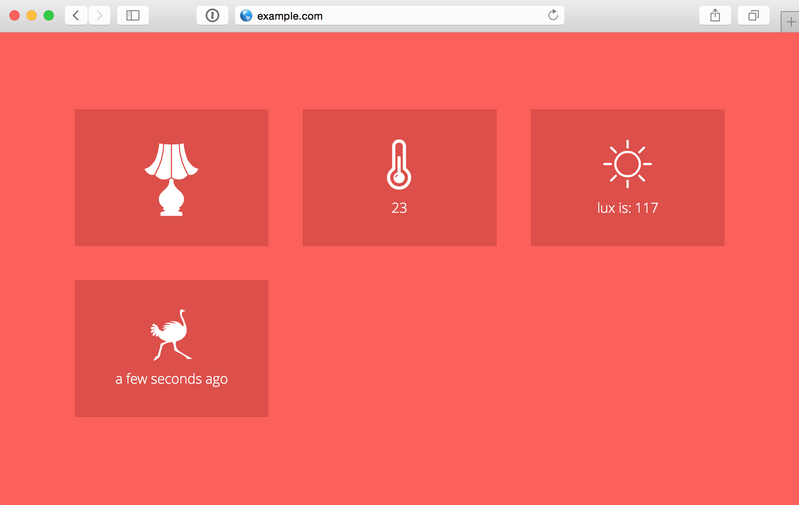

Koti Home
========



Koti Home (the name comes from the Finnish word “koti” that means “home”) is a home automation system based on Arduino that I’ve built.

Right now supports the following features:

* Showing home temperature (in Celsius)
* Notifying by email (or text message with the help of [IFTTT](https://ifttt.com)) if movement occurred
* Switching the light on and off remotely (might be any electronic device)
* Voice commands like “turn the light on” and “what’ up” — the latter is a status update

Koti Home uses Node.js on a server (I use a [DigitalOcean VPS](https://www.digitalocean.com/?refcode=054bb617bf5e)), some JavaScript and Jquery on a client and Arduino Uno with a couple of sensors as a main controller hub.  

## Usage

1. Get an Arduino Uno with an Ethernet shield (or some version of Arduino that already includes one, you can also use Wi-Fi) and all the necessary sensors. I have a temperature, light, relay and motion. Connect everything.
2. Clone this repository, rename ```example_config.json``` to ```config.json``` and change all the credentials, like email and passwords. Also set your local IP address and the remote URL at ```Arduino/KotiServer.ino```.
3. Upload the ```Arduino/KotiServer.ino``` to Arduino board and set up the ```koti.js``` app on your server. I recommend [PM2](https://github.com/Unitech/pm2).
4. Buy a huge chair, a desk and a Darth Vader mask. Make a Margarita and control ~~the planet~~ your house.
Disclaimer: chair, desk, mask and Margarita are sold separately.
